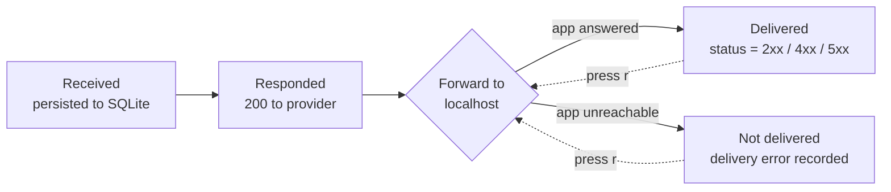
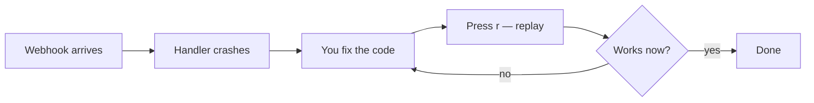

# Events &amp; replay

An **event** is a single received webhook. It is the unit of history and the
unit of replay. Every event webhook-it receives is persisted to the local
SQLite database — nothing is ever dropped.

## What is stored

Each event captures everything needed to reproduce the request exactly:

| Field | Description |
|---|---|
| **id** | A short, easy-to-type id (e.g. `k4m2p9x1c7`). |
| **endpoint** | Which endpoint received it. |
| **method** | `GET`, `POST`, `PUT`, `PATCH`, `DELETE`, `HEAD` or `OPTIONS`. |
| **path suffix** | Any path after the endpoint name — e.g. `/refunds`. |
| **query** | The query-string parameters. |
| **headers** | Every header, as received. |
| **body** | The **raw body bytes**, stored verbatim. |
| **received at** | When the event reached the daemon. |
| **delivered at** | When the forward to localhost finished (or `null`). |
| **delivery status** | The HTTP code your local app returned (or `null`). |
| **delivery error** | The error message, if the forward failed. |

:::info Why the body is stored byte-for-byte
Providers sign the **exact bytes** of the request body. `Stripe-Signature` and
`X-Hub-Signature-256` are HMACs over the raw payload. Re-serializing the JSON —
even just reordering keys or changing whitespace — would invalidate the
signature. webhook-it stores the body as raw bytes so a forward or a replay
carries a signature your handler will still accept.
:::

## The event lifecycle

1. **Received.** The daemon writes the event row. At this point it is permanent.
2. **Responded.** The daemon answers the provider `200 {"id": "..."}`
   immediately — it does **not** wait for the forward.
3. **Forwarded.** Asynchronously, the event is sent to the endpoint's target.
4. **Recorded.** The outcome — a status code, or an error — is written back to
   the event row.

Because steps 1–2 happen before step 3, **the provider's success never depends
on your local app being up**.

## Delivery status

The Events pane shows the delivery status of each event, color-coded:

| Shown | Meaning |
|---|---|
| `200`, `201`, `204` … | Your local app responded with this HTTP code. |
| `400`, `404`, `500` … | Your app responded, but with an error code (shown in red). |
| `···` | Not delivered — the forward never got a response (app down, wrong port). |

*A `500` (red — your app errored) and a `···` (dim — never delivered) among the
events.*

:::caution The daemon does not relay your app's response
webhook-it always answers the **provider** with `200` as soon as it persists the
event. The status column reflects what your **local app** returned on the
forward — it is for *your* eyes, it is never sent back upstream. A provider that
needs a specific synchronous response body (e.g. a challenge echo) is out of
scope for the MVP — see the [Roadmap](../project/roadmap.md).
:::

## What gets forwarded

When the daemon forwards an event to your local target, it rebuilds the request
faithfully:

- **Method** — the original method is reused.
- **Path** — `target URL` + the captured path suffix.
- **Query** — the original query parameters are re-attached.
- **Headers** — every header is passed through, **except** hop-by-hop headers
  that must not be relayed (`host`, `content-length`, `connection`,
  `keep-alive`, `transfer-encoding`, `accept-encoding`). Signature headers pass
  through untouched.
- **Body** — the raw bytes, for any method other than `GET` / `HEAD`.

## Replay

**Replay** re-sends a stored event to its endpoint's current target — the same
method, the same headers, the same body bytes. It is the heart of the debugging
loop.

To replay, select an endpoint in the dashboard and press <kbd>r</kbd>.
webhook-it re-forwards the **most recent** event of that endpoint and updates
its delivery status with the new result.

### The debugging loop

A real webhook breaks your handler. The event is already saved. You fix the
code, press <kbd>r</kbd>, and the **identical** payload runs again — no
re-triggering the provider, no copy-paste. Repeat until it is green.

Replay also rescues an event whose forward failed because your app was down:
start the app, select the endpoint, press <kbd>r</kbd>.

:::note MVP scope: replay targets the latest event
Today <kbd>r</kbd> replays the **most recent** event of the selected endpoint.
Per-event selection — picking any event from the history to replay — is on the
[Roadmap](../project/roadmap.md).
:::

## Next

- [Replaying events](../dashboard/replaying.md) — the dashboard action in detail.
- [Debugging failed events](../guides/debugging.md) — a full worked example.
- [Files &amp; configuration](../reference/files-and-config.md) — the SQLite
  schema events are stored in.
