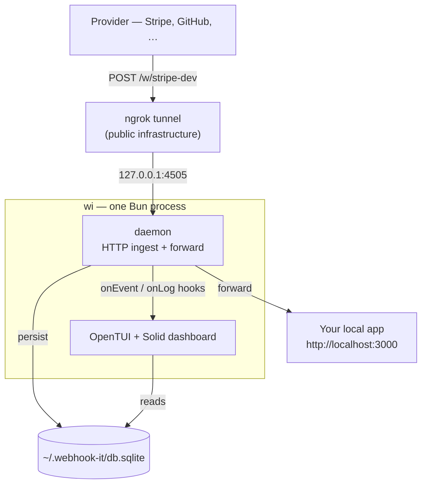
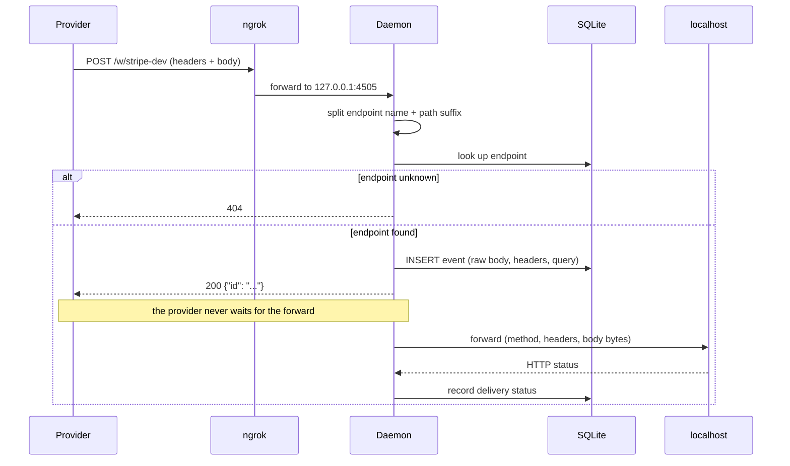
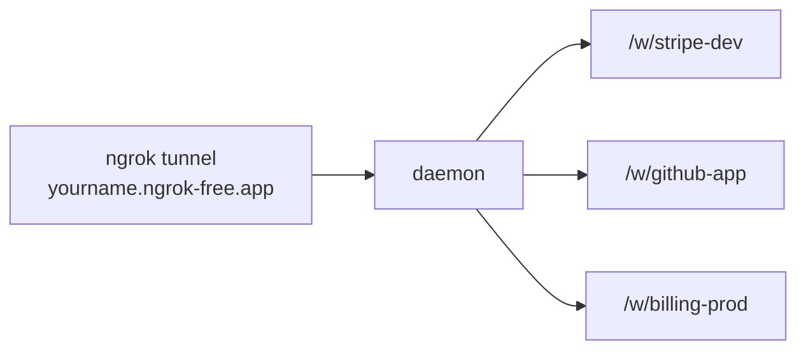

# How it works

webhook-it has a deliberately small mental model. Once it clicks, every feature
in the dashboard makes sense.

## One process

Everything runs on your machine, inside a **single Bun process**: the
interactive dashboard *and* the daemon it hosts. The only piece outside your
machine is the ngrok tunnel, which provides the public address.

The dashboard **hosts the daemon in its own process**. Pressing <kbd>u</kbd>
calls `startDaemon`; the daemon's `onEvent` / `onLog` hooks feed the UI
directly, so a live webhook updates the screen with no inter-process
communication.

## The pieces

| Piece | What it is | Where it lives |
|---|---|---|
| **Dashboard** | The interactive terminal UI you interact with | `apps/cli` |
| **Daemon** | HTTP server that ingests and forwards webhooks | `packages/core` |
| **Tunnel** | ngrok subprocess giving you a public URL | external binary |
| **Database** | Local SQLite file — endpoints + event history | `~/.webhook-it/db.sqlite` |
| **Config** | Your ngrok domain and ingest port | `~/.webhook-it/config.json` |

The dashboard is **presentation only**. All the behavior — receiving,
persisting, forwarding, replay — lives in the daemon and core, which know
nothing about the UI. That separation is why a web UI could be added later
without a rewrite.

## The life of a webhook

Here is exactly what happens when a provider calls your URL:

Step by step:

1. The provider does `POST https://yourname.ngrok-free.app/w/stripe-dev`.
2. ngrok forwards it to the daemon at `127.0.0.1:4505`.
3. The daemon splits the path into an **endpoint name** (`stripe-dev`) and an
   optional **path suffix**.
4. It looks the endpoint up in SQLite. Unknown endpoint → `404`.
5. It reads the body as raw bytes, normalizes headers and query, and `INSERT`s
   an `event` row.
6. It responds **`200 {"id": "..."}` immediately** — the provider never waits.
7. **Asynchronously**, it forwards the event to the endpoint's local target,
   preserving the method, headers and body bytes.
8. It records the result (delivered, status code, or error) and reports it to
   the dashboard.

The two design decisions worth remembering:

- **The provider gets `200` the instant the event is persisted.** The forward to
  your app happens afterwards and never blocks the response. Even if your app is
  down, the provider is happy and the event is safe.
- **The body is stored byte-for-byte.** Any mutation would break signature
  validation (`Stripe-Signature`, `X-Hub-Signature-256`). See
  [Events &amp; replay](./events-and-replay.md).

## One tunnel, many endpoints

The ngrok free plan allows one active tunnel. That is not a limitation:

The single tunnel points at the daemon, and **per-endpoint routing is done by
the daemon, via the path** (`/w/<name>`). One daemon, any number of logical
endpoints — each with its own URL and its own local target.

## What happens when…

**…your local app is down?**
The event is already saved and the provider already got `200`. The forward
records the error. With your app back up, press <kbd>r</kbd> to
[replay](./events-and-replay.md) it.

**…the dashboard is closed?**
The tunnel is not up, so the provider gets an error from ngrok and the webhook
is lost. This is the accepted trade-off of the "no server" model — see the
[FAQ](../project/faq.md#operational-limits).

**…a webhook arrives for an endpoint that does not exist?**
The daemon responds `404` and the dashboard footer notes the unknown endpoint.
Nothing is persisted.

## Next

- [Endpoints](./endpoints.md) — naming, targets and the `/w/<name>` route.
- [Events &amp; replay](./events-and-replay.md) — what is stored and why.
- [Architecture reference](../reference/architecture.md) — the deep technical
  view, package by package.
