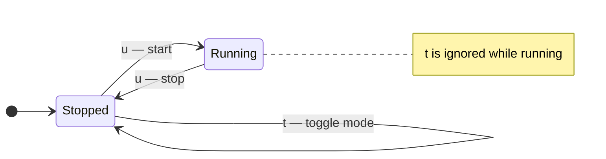
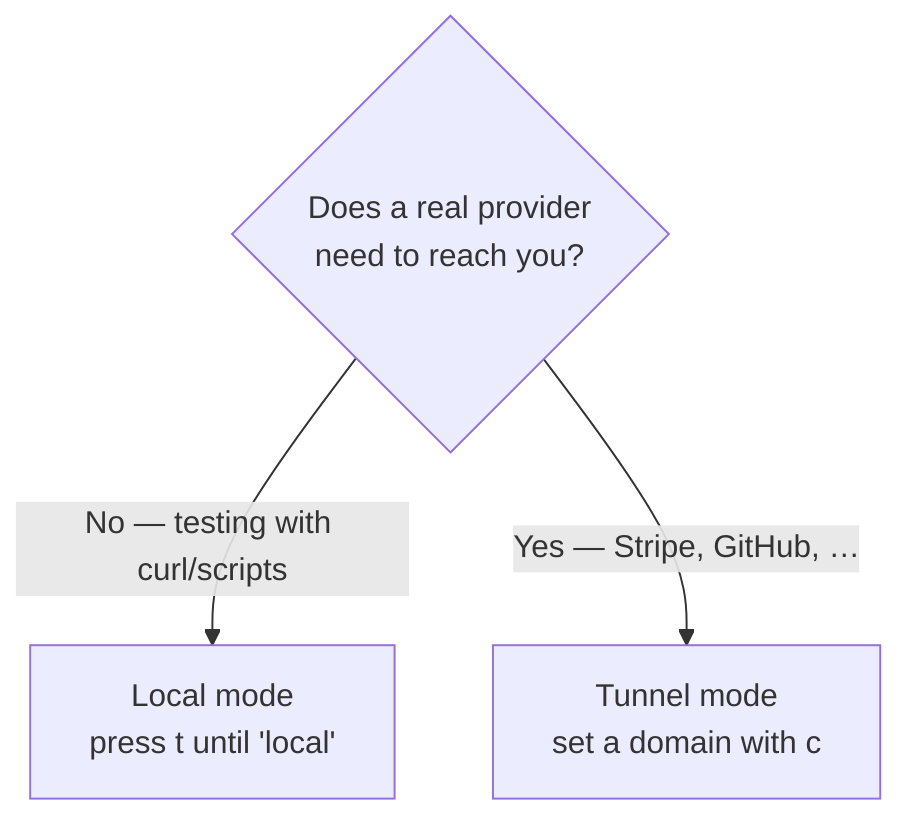

# The two modes

The daemon runs in one of two modes. They differ in **one thing**: whether an
ngrok tunnel is started, and therefore what URL receives webhooks.

| | 🖥️ Local mode | 🌍 Tunnel mode |
|---|---|---|
| Needs ngrok | No | Yes |
| URL that receives webhooks | `http://127.0.0.1:4505/w/<name>` | `https://<your>.ngrok-free.app/w/<name>` |
| Reachable from the internet | No | Yes |
| Best for | Testing locally with `curl` | Real providers (Stripe, GitHub…) |

Everything else is identical. In both modes the daemon persists events,
forwards them to your targets, and feeds the dashboard. Only the front door
changes.

## Local mode

In local mode the daemon starts **just the HTTP server** on
`127.0.0.1:4505` — no tunnel, no ngrok, no account.

*Local mode — the header shows `running (local)` and the `127.0.0.1` base URL.*

Use local mode to:

- Test a handler with `curl` or a script, without any provider involved.
- Develop offline.
- Try webhook-it before setting up ngrok at all.

The catch is in the name: `127.0.0.1` is reachable **only from your machine**.
No external provider can call it. See
[Local testing in depth](../guides/local-testing.md).

## Tunnel mode

In tunnel mode the daemon starts the HTTP server **and** an ngrok tunnel
pointing at it. ngrok gives you a public `https://` URL that the whole internet
can reach — including Stripe and GitHub.

*Tunnel mode — the header shows `running (tunnel)` and the public ngrok URL.*

Tunnel mode requires a one-time ngrok setup (install, authenticate, reserve a
static domain) covered in [Installation](../installation.md#set-up-ngrok-optional).
The **static domain** is what makes your URL *stable* — it survives restarts, so
a webhook you registered with a provider keeps working.

Use tunnel mode to receive **real events from real providers**. See
[Connecting a real provider](../guides/connecting-a-provider.md).

## How the mode is chosen

webhook-it picks the initial mode for you:

- If an **ngrok domain is configured**, it starts in **tunnel mode**.
- If **no domain is set**, it starts in **local mode**.

On first run, if no domain is configured, the dashboard opens the
[domain setup prompt](../dashboard/the-daemon.md#first-run-setup) automatically.
Fill it in for tunnel mode, or press <kbd>esc</kbd> to skip and stay local.

## Switching modes

Press <kbd>t</kbd> to toggle between tunnel and local mode.

:::caution Toggle only while stopped
You can only change mode while the daemon is **stopped**. If you press
<kbd>t</kbd> while it is running, webhook-it tells you to stop it first. Stop
with <kbd>u</kbd>, toggle with <kbd>t</kbd>, start again with <kbd>u</kbd>.
:::

Pressing <kbd>u</kbd> in tunnel mode with no domain configured does not start
the daemon — webhook-it prompts you to set a domain (<kbd>c</kbd>) or switch to
local mode (<kbd>t</kbd>).

## Which should I use?

Most real integration work happens in tunnel mode. Local mode shines for fast,
offline iteration and for trying things out before committing to ngrok.

## Next

- [The daemon](../dashboard/the-daemon.md) — starting, stopping, statuses.
- [Local testing in depth](../guides/local-testing.md) — the local-mode workflow.
- [Connecting a real provider](../guides/connecting-a-provider.md) — the
  tunnel-mode workflow.
