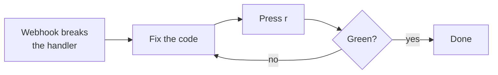

# Replaying events

**Replay** re-sends a stored event to its endpoint's target. It is the single
most useful action in webhook-it for day-to-day debugging — covered as a concept
in [Events &amp; replay](../concepts/events-and-replay.md), and as a dashboard
action here.

## How to replay

1. Select the endpoint in the **Endpoints** pane.
2. Press <kbd>r</kbd>.

webhook-it re-forwards the endpoint's **most recent** event and reports the
result in the footer status line:

```
replayed k4m2p9x1c7 -> 200 (37ms)
```

or, if it failed:

```
replay failed: connect ECONNREFUSED 127.0.0.1:3000
```

The event's delivery status is updated in place with the new outcome, so the
Events pane reflects the latest attempt.

## What replay sends

A replay reconstructs the request **exactly** as it was received:

- the same **method**;
- the same **path suffix** and **query string**;
- the same **headers** (signatures included);
- the same **body bytes**.

Because the body is stored byte-for-byte, a replayed request carries a signature
your handler will still accept — `Stripe-Signature` and friends survive intact.
The forward goes to the endpoint's **current** target, so if you changed the
target, the replay follows the new one.

## When to use it

### Debug a handler

The core loop: a webhook breaks your handler, the event is saved, you fix the
code, you press <kbd>r</kbd>.



No re-triggering the provider, no copy-paste — the same payload, on demand, as
many times as it takes.

### Recover a failed delivery

A webhook arrived while your app was down, so its forward failed (status `···`,
shown dim).


*The `···` row never reached localhost — start your app, then press <kbd>r</kbd>.*

Start your local app, select the endpoint, press <kbd>r</kbd>. The saved event
is delivered — nothing was lost while the app was down.

### Re-run a payload tomorrow

Old events do not expire. A payload you received days ago is still there; select
its endpoint and replay it whenever you need that exact request again.

## Scope and limits

:::note Replay targets the latest event
Today <kbd>r</kbd> always replays the **most recent** event of the selected
endpoint. To replay an older one, it needs to be the latest for that endpoint.
**Per-event selection** — choosing any event from the feed to replay — is a
planned improvement; see the [Roadmap](../project/roadmap.md).
:::

If the selected endpoint has **no events**, <kbd>r</kbd> reports
*no events for '&lt;name&gt;' yet*. If no endpoint is selected, it reports
*no endpoint selected*.

## Next

- [Debugging failed events](../guides/debugging.md) — a full worked example.
- [Events &amp; replay](../concepts/events-and-replay.md) — the concept and the
  event lifecycle.
