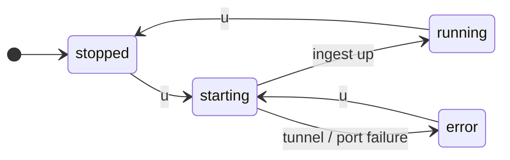

# The daemon

The **daemon** is the part of webhook-it that actually receives webhooks. While
it is stopped, your endpoints exist but nothing can reach them. This page covers
the keys that control it: <kbd>u</kbd>, <kbd>t</kbd> and <kbd>c</kbd>.

## Starting and stopping — `u`

Press <kbd>u</kbd> to **start** the daemon. Press <kbd>u</kbd> again to **stop**
it.

What "start" does depends on the [mode](../concepts/modes.md):

- **Local mode** — starts the HTTP ingest server on `127.0.0.1:4505`.
- **Tunnel mode** — starts the HTTP server **and** an ngrok tunnel pointing at
  it, then waits for the tunnel to come up.

When the daemon is **running**, the header shows the status in green and the
public base URL. Your endpoints' `public url` fields fill in. Stopping it tears
down the tunnel and the server cleanly.

## The status

The header status, color-coded, is the daemon's state of truth:

| Status | Color | Meaning |
|---|---|---|
| `stopped (local\|tunnel)` | dim | Not running. Press <kbd>u</kbd> to start. |
| `starting (...)` | amber | Coming up — in tunnel mode, waiting on ngrok. |
| `running (...) — <url>` | green | Up and receiving. The URL is your base address. |
| `error (...)` | red | Failed to start. The footer status line has the reason. |

Common start failures and what they mean:

| Footer message | Cause | Fix |
|---|---|---|
| `'ngrok' binary not found in PATH` | ngrok is not installed. | Install it — see [Installation](../installation.md#set-up-ngrok-optional). |
| `ngrok: ...` | ngrok rejected the tunnel (bad authtoken, domain in use). | Check your authtoken and that the domain is reserved and free. |
| `timed out waiting for the ngrok tunnel to come up (15s)` | ngrok did not signal success in time. | Retry; check your network. |
| `no ngrok domain — press 'c'...` | Tunnel mode with no domain set. | Set a domain (<kbd>c</kbd>) or switch to local (<kbd>t</kbd>). |

## Switching mode — `t`

Press <kbd>t</kbd> to toggle between **tunnel** and **local** mode. The footer
confirms the new mode.

:::caution Stop before you toggle
<kbd>t</kbd> only works while the daemon is **stopped**. Press it while running
and webhook-it tells you to stop first. The order is: <kbd>u</kbd> to stop,
<kbd>t</kbd> to toggle, <kbd>u</kbd> to start again.
:::

See [The two modes](../concepts/modes.md) for the full comparison.

## Setting the ngrok domain — `c` {#setting-the-ngrok-domain}

Press <kbd>c</kbd> to open the **ngrok domain** prompt. Enter your reserved
static domain — e.g. `yourname.ngrok-free.app` — and press <kbd>enter</kbd>.

Setting a domain:

- saves it to `~/.webhook-it/config.json` so it persists across runs;
- switches the dashboard into **tunnel mode**.

Submitting an **empty** domain clears it and switches back to local mode.

You only need to do this **once per machine**. After that, webhook-it starts in
tunnel mode automatically.

## First-run setup

On the very first run — when no ngrok domain has ever been configured — the
dashboard opens the domain prompt **for you**, with a short hint:

*First run — set a domain for tunnel mode, or press <kbd>esc</kbd> to skip.*

- Enter your domain and press <kbd>enter</kbd> → tunnel mode, ready for real
  providers.
- Press <kbd>esc</kbd> to skip → local mode, no ngrok needed. You can set the
  domain any time later with <kbd>c</kbd>.

## What "running" requires

For a webhook to actually arrive, **all** of these must hold:

1. Your machine is on.
2. `wi` is open.
3. The daemon is started (<kbd>u</kbd>).
4. In tunnel mode, the ngrok tunnel is up.

Close the dashboard and webhooks stop arriving — there is no background service.
This is the deliberate trade-off of the no-server model; see the
[FAQ](../project/faq.md#operational-limits).

## Quitting

Press <kbd>q</kbd> (or <kbd>Ctrl</kbd>+<kbd>C</kbd>) to quit. webhook-it stops
the daemon, tears down the tunnel, closes the database and exits cleanly — you
do not need to stop the daemon manually first.

## Next

- [The two modes](../concepts/modes.md) — local vs. tunnel.
- [Replaying events](./replaying.md) — what to do when a forward fails.
- [Connecting a real provider](../guides/connecting-a-provider.md) — tunnel mode
  end to end.
