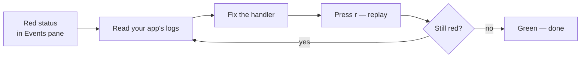

# Debugging failed events

webhook-it is built for the moment a webhook **breaks** something. This guide is
a worked example of the debugging loop: spot the failure, replay, fix, repeat.

## Scenario

You are building a Stripe integration. Events are arriving — but your handler
keeps erroring. Here is how to drive it to green with webhook-it.

## Step 1 — Read the delivery status

Select the endpoint and look at the **Events** pane. The status column is
color-coded:

*A `500` in red, and a `···` in dim — two different kinds of failure.*

| Shown | Colour | What it means |
|---|---|---|
| `200`, `201`, `204` | normal | Delivered — your handler accepted it. |
| `400`, `409`, `500` | **red** | Delivered — but your handler returned an error. |
| `···` | **dim** | **Not delivered** — nothing answered the forward. |

The two failure modes need different fixes.

## Step 2a — Fix a `···` (never delivered)

`···` means the forward never reached anything. The footer status line carries
the reason, usually one of:

| Footer message | Cause |
|---|---|
| `connect ECONNREFUSED 127.0.0.1:3000` | Nothing is listening on that port — your app is down. |
| `getaddrinfo ENOTFOUND ...` | The target host name does not resolve. |
| timeout / socket errors | The app accepted the connection but never responded. |

Fix the cause:

1. Start your local app, or correct the port.
2. Confirm the endpoint's **target** (shown in the Endpoints pane) is right.
3. Select the endpoint and press <kbd>r</kbd> to [replay](../dashboard/replaying.md).

The saved event is re-delivered — nothing was lost while the app was down.

## Step 2b — Fix a red status (handler errored)

A red `4xx`/`5xx` means the request **did** reach your handler, and your handler
returned an error. The bug is in your code. The loop:

1. Read your application's own logs to see why it returned the error.
2. Fix the handler code.
3. Back in webhook-it, with the endpoint selected, press <kbd>r</kbd>.
4. The **exact same payload** — same bytes, same signature — runs again.
5. The status updates in place. Repeat until it is green.

This is the whole point of webhook-it: you never re-trigger the provider, and
you never copy a payload by hand.

## Why replay is reliable

A common false failure is a **broken signature**. Providers sign the raw request
body; if a test tool re-serializes the JSON, the signature no longer matches and
the handler rejects a request that was actually fine.

webhook-it stores the body **byte-for-byte** and replays those exact bytes with
the original headers. So when you replay, a signature check that would pass in
production passes here too — a red status is your bug, not a testing artifact.
See [Events &amp; replay](../concepts/events-and-replay.md#what-is-stored).

## Step 3 — Common situations

### "The event isn't even showing up"

If a webhook does not appear in the Events pane at all:

- Is the **daemon running**? The header must be green.
- Did the provider get an error? In tunnel mode, the daemon must be up for ngrok
  to forward anything.
- Is the URL exactly `/w/<endpoint-name>`? A wrong name returns `404` and the
  footer notes *webhook for unknown endpoint*.
- Are you looking at the **right endpoint**? The Events pane shows only the
  selected endpoint's feed.

### "Replay says no events"

`no events for '<name>' yet` means that endpoint has received nothing. Replay
needs a stored event to re-send. Trigger one first (a real event, or a `curl` in
[local mode](./local-testing.md)).

## Debugging `wi apply`

When `wi apply` fails, it tells you exactly why and exits `1`:

*An invalid `.webhook-it.json` — every problem is listed with its path.*

| Message | Fix |
|---|---|
| `no .webhook-it.json found...` | Run from inside a repo that has the file, or create one. |
| `... is not valid JSON: ...` | Fix the JSON syntax (a trailing comma, a missing brace). |
| `... is invalid:` followed by `- path: message` | Fix each listed field — bad endpoint name, invalid target URL, etc. |

See [Project config schema](../reference/project-config-schema.md) for the rules
every field must satisfy.

## Checklist

When something is wrong, run down this list:

- [ ] Daemon running? (green header)
- [ ] Right endpoint selected?
- [ ] Status red, or `···`? (handler bug vs. unreachable)
- [ ] Local app up, on the right port?
- [ ] Endpoint target correct?
- [ ] Footer status line — what does it say?
- [ ] Tried <kbd>r</kbd> to replay after fixing?

## Next

- [Replaying events](../dashboard/replaying.md) — the replay action in full.
- [Events &amp; replay](../concepts/events-and-replay.md) — the event lifecycle.
- [CLI reference](../reference/cli.md) — `wi apply` errors and exit codes.
