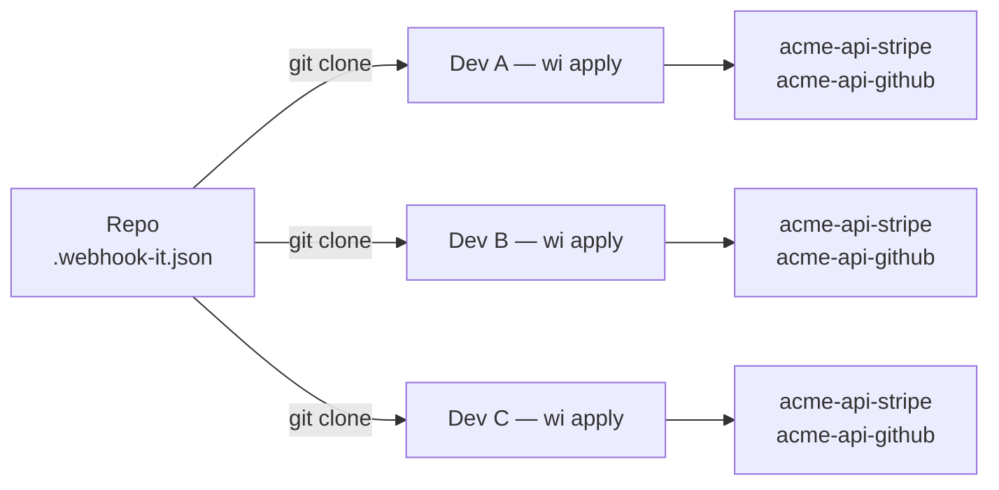

# Team workflow

When more than one developer works on a service, they all need the same set of
webhook endpoints. Recreating them by hand on every machine is tedious and
drifts out of sync. webhook-it solves this with a committed
[`.webhook-it.json`](../concepts/project-config.md) and the `wi apply` command.

## The idea



The repository owns the list of endpoints. Each developer's machine owns the
personal bits — the ngrok domain. `wi apply` reconciles the two.

## Step 1 — Add `.webhook-it.json` to the repo

Create the file at the repository root and commit it:

```json title=".webhook-it.json"
{
  "$schema": "https://github.com/carlos3g/webhook-it/blob/main/webhook-it.schema.json",
  "project": "acme-api",
  "endpoints": {
    "stripe": { "target": "http://localhost:3000/hooks/stripe" },
    "github": { "target": "http://localhost:3000/hooks/github" }
  }
}
```

- `project` namespaces every endpoint — `stripe` becomes `acme-api-stripe`, so
  this repo never collides with another.
- `endpoints` maps each name to the local target on a developer's machine. Use
  whatever port the project's dev server runs on.
- The file holds **no secrets** — commit it without a second thought.

The full reference is in
[Project config schema](../reference/project-config-schema.md).

## Step 2 — A teammate clones and applies

A new developer joins. Their entire setup is:

```bash
# one-time per machine: install ngrok, authenticate, reserve a domain
ngrok config add-authtoken <token>

# one-time per machine: tell webhook-it the domain
wi              # press c, enter your ngrok domain, then q

# in the cloned repo:
wi apply
```

`wi apply` reads `.webhook-it.json` and creates every endpoint:


*A fresh machine — both endpoints created, namespaced under `acme-api`.*

That is it. No endpoint set up by hand; nothing shared but a file in git.

## Step 3 — Keep it in sync

When the endpoint list changes — someone adds a provider, or a target moves —
edit `.webhook-it.json`, commit, and everyone runs `wi apply` again after they
pull. Because `apply` is **idempotent**, re-running it is always safe:


*A later run after edits — created, updated, unchanged and orphan, all reported.*

| Mark | Meaning |
|---|---|
| `+` | Created — new in the file. |
| `~` | Updated — the target changed. |
| `=` | Unchanged — already matches. |
| `?` | Orphan — stored here, but no longer in the file (kept, not deleted). |

## Step 4 — Or just open `wi`

A teammate does not even have to remember `wi apply`. Opening `wi` inside the
repo makes the dashboard **detect** `.webhook-it.json` and offer to apply any
pending changes:


*Open `wi` in the repo — it offers to apply pending changes. Press <kbd>y</kbd>.*

## Running in CI

`wi apply` is non-interactive and has clean exit codes — `0` on success, `1` on
a missing or invalid file. That makes it safe in automation: a setup script, a
`postinstall` hook, or a CI job that lints the config.

```bash
# fails the job if .webhook-it.json is missing or malformed
wi apply
```

## Good practices

:::tip Keep one project per repository
Use a distinct `project` name per repository. The namespace is the collision
boundary — `acme-api` and `acme-billing` keep their `stripe` endpoints fully
separate.
:::

:::note Apply never deletes
Dropping an endpoint from the file does not remove it — it becomes a reported
**orphan**. To actually delete an endpoint and reclaim the name, do it
deliberately in the dashboard with <kbd>d</kbd>. Event history is kept either
way.
:::

## Next

- [Project config](../concepts/project-config.md) — the concept in depth.
- [Project config schema](../reference/project-config-schema.md) — every field.
- [CLI reference — `wi apply`](../reference/cli.md#wi-apply) — exit codes and
  output.
