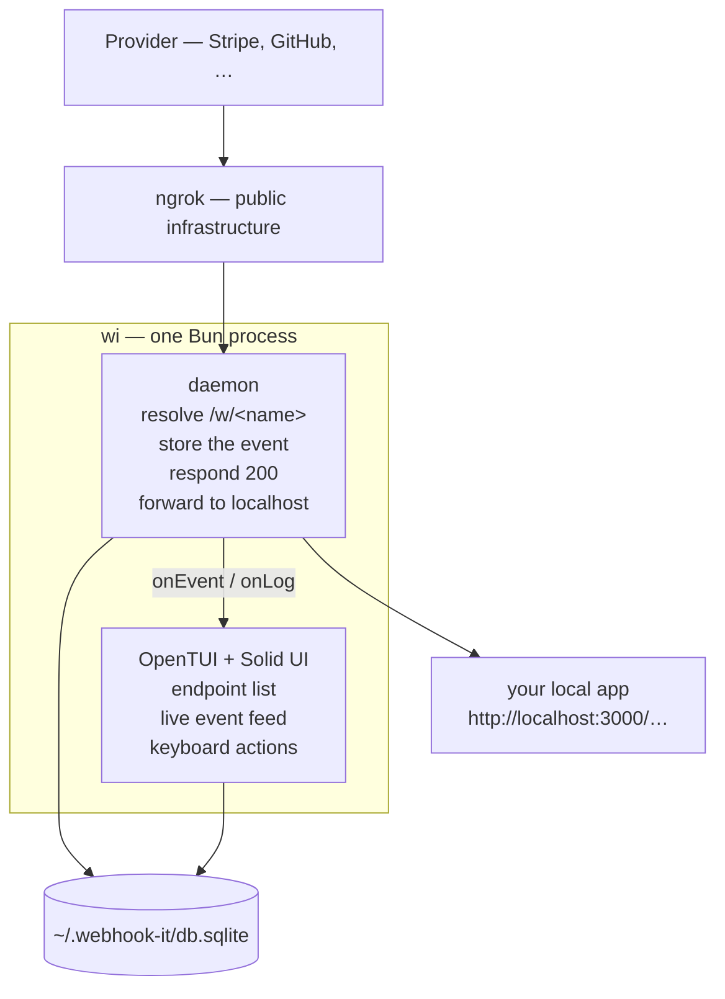
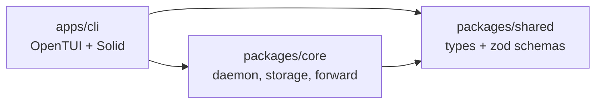
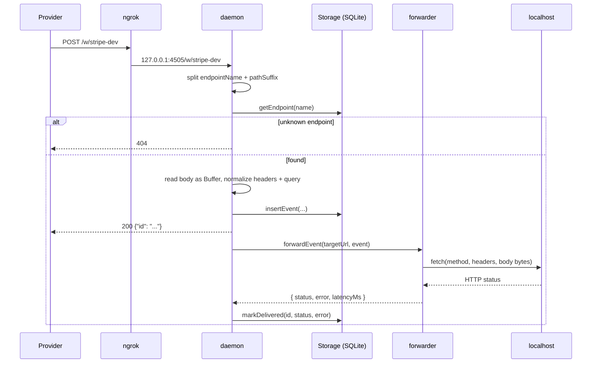

# Architecture

This page is the deep technical view of webhook-it — for contributors, and for
anyone who wants to understand exactly how it works. For the gentler overview,
read [How it works](../concepts/how-it-works.md) first.

## Overview

Everything runs on the developer's machine, inside a single Bun process: the
interactive dashboard and the daemon it hosts. The only piece outside the
machine is the ngrok tunnel.



## The monorepo

webhook-it is a Bun-workspaces monorepo. Three layers, one dependency direction.

```
webhook-it/
├── apps/
│   └── cli/          @carlos3g/webhook-it — the interactive dashboard
├── packages/
│   ├── core/         @webhook-it/core — the daemon and everything it needs
│   ├── shared/       @webhook-it/shared — types + zod schemas
│   └── tsconfig/     @webhook-it/tsconfig — base TypeScript configs
└── docs/
```



- **`shared`** — types and zod schemas only (`Endpoint`, `WebhookEvent`,
  `HttpMethod`). No runtime APIs, importable anywhere.
- **`core`** — all the behavior. Knows nothing about the UI.
- **`cli`** — the dashboard. Presentation only; it calls into `core`.

The clean `cli → core → shared` direction is what would let a web UI reuse
`core` + `shared` unchanged.

## `apps/cli` — the dashboard

A terminal app built with [OpenTUI](https://github.com/anomalyco/opentui) and
its Solid binding, compiled by Bun into a single executable.

| File | Role |
|---|---|
| `index.ts` | Entry point. Handles `--help` / `--version` / `wi apply`; otherwise opens `Storage`, reads config, renders the dashboard. OpenTUI is imported **lazily**, so headless commands never load the native terminal core. |
| `app.tsx` | The whole dashboard — Solid signals for state, the daemon lifecycle, the keyboard router, the layout, and the prompt / confirm overlays. |
| `theme.ts` | The colour palette (GitHub-light inspired). |
| `build.ts` | `Bun.build` with the Solid plugin + `compile` → the standalone binary. |

The dashboard **hosts the daemon in its own process**. Pressing <kbd>u</kbd>
calls `core`'s `startDaemon`; the daemon's `onEvent` / `onLog` hooks set Solid
signals, so the UI reacts to incoming webhooks with no IPC. A short polling
interval re-reads the SQLite file so the panes stay in sync with what the daemon
writes.

## `packages/core` — the daemon

Everything that is not presentation.

| File | Role |
|---|---|
| `daemon.ts` | `startDaemon()` — an HTTP server on `127.0.0.1:<port>`, optionally with the ngrok tunnel. Returns a handle with `publicUrl` and `stop()`. |
| `storage.ts` | The `Storage` class over `bun:sqlite`. Synchronous on purpose. |
| `forwarder.ts` | `forwardEvent()` — re-sends an event to the local target, preserving method, headers and body bytes. Used by the daemon and by replay. |
| `tunnel/ngrok.ts` | `NgrokTunnel` — runs the `ngrok` binary as a subprocess and reads its JSON log to know when the tunnel is up. |
| `config.ts` / `paths.ts` | Read/write `~/.webhook-it/config.json` and resolve paths under `~/.webhook-it/`. |
| `project.ts` | The `.webhook-it.json` logic — find (walk up), validate (zod), `plan` / `execute` the reconcile that `wi apply` and the dashboard's auto-detect share. |

## The flow of a webhook



The forward drops only the hop-by-hop headers (`host`, `content-length`,
`connection`, `keep-alive`, `transfer-encoding`, `accept-encoding`) — every
other header, signatures included, passes through untouched.

## Technical decisions

### Why Bun

OpenTUI only runs on Bun — it loads a native Zig core through `bun:ffi`, and
`@opentui/core` declares `engines: { bun: ">=1.3.0" }`. Choosing OpenTUI meant
adopting Bun. Bun also collapses the toolchain: it runs TypeScript directly, is
the package manager, compiles a standalone binary, and ships `bun:sqlite`.

### Why SQLite via `bun:sqlite`

Built into Bun — zero external dependency, zero extra processes, and the state
is a single file (easy to inspect, copy or delete). The API is synchronous,
which keeps the code simple: a single-user local database has no real
concurrency.

### Why the daemon runs inside the dashboard

The dashboard is what the user keeps open, and the daemon must be up to receive
webhooks — so they are the same process. The daemon's `onEvent` / `onLog` hooks
feed Solid signals directly: a live webhook updates the UI with no IPC.

### Why a tunnel, and why ngrok

A public URL needs infrastructure on the internet. Between running your own
server and using a tunnel, the tunnel avoids deployment and cost. ngrok was
chosen because it offers **one free static domain per account** — which solves
the expiring-URL problem. The daemon runs the user's installed `ngrok` binary,
so webhook-it bundles no native SDK. The tunnel layer is an isolated adapter, so
other tunnels (Cloudflare, Tailscale) could be added later.

### Why one tunnel for several endpoints

The ngrok free plan allows one active tunnel. That is fine: the tunnel points at
the daemon, and per-endpoint routing happens in the daemon, by path
(`/w/<name>`). One daemon, N logical endpoints.

## Known risks

| Risk | Mitigation |
|---|---|
| Dashboard closed → webhook lost | Accepted limit of the no-server model. Documented. A background daemon is on the [roadmap](../project/roadmap.md). |
| Provider needs a specific synchronous response (e.g. a challenge echo) | Today the daemon always answers `200 {id}`. A waiting handler is out of MVP scope. |
| Body larger than the ngrok plan limit | Most webhooks are small; the limit is documented by ngrok. |
| `ngrok` missing / unauthenticated / wrong domain | The adapter detects it and surfaces a clear error in the dashboard. |

## Next

- [How it works](../concepts/how-it-works.md) — the lighter overview.
- [Files &amp; configuration](./files-and-config.md) — the SQLite schema.
- [Contributing](../project/contributing.md) — build and develop the code.
